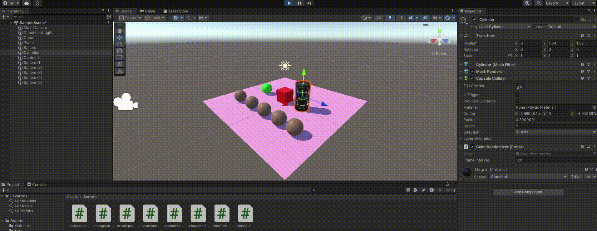
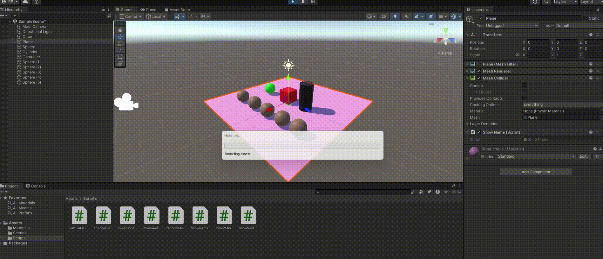
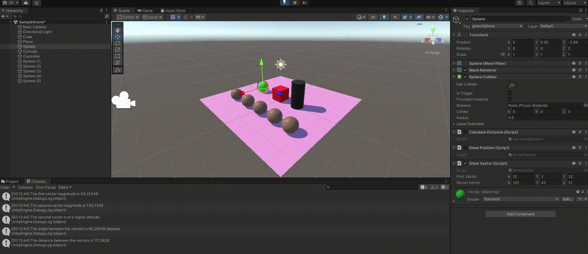
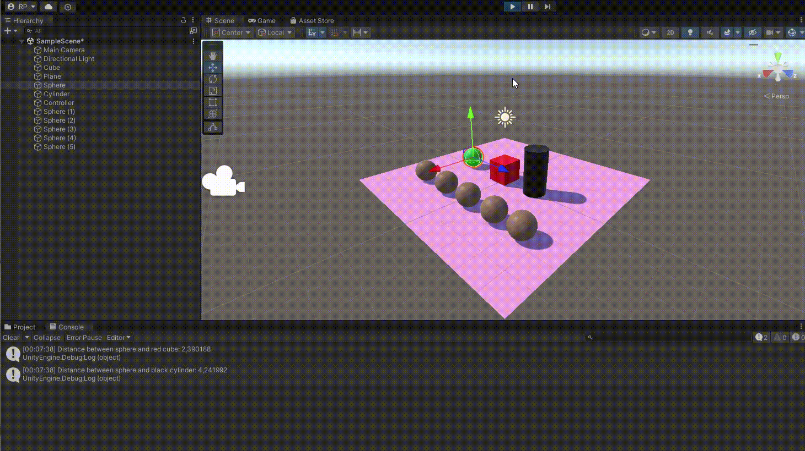
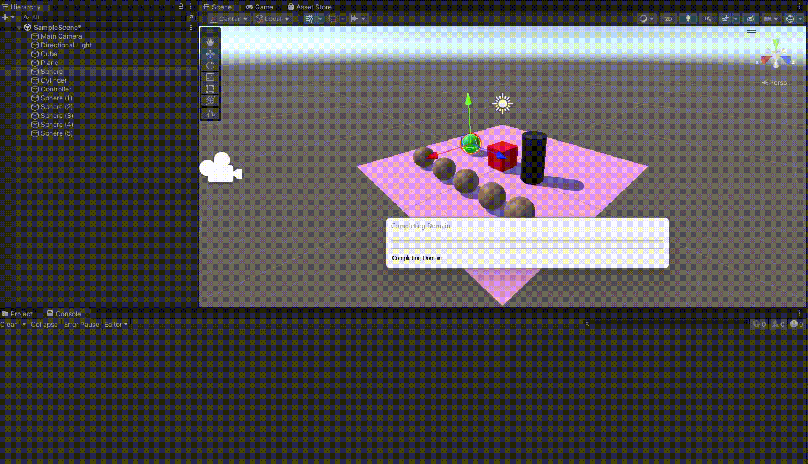
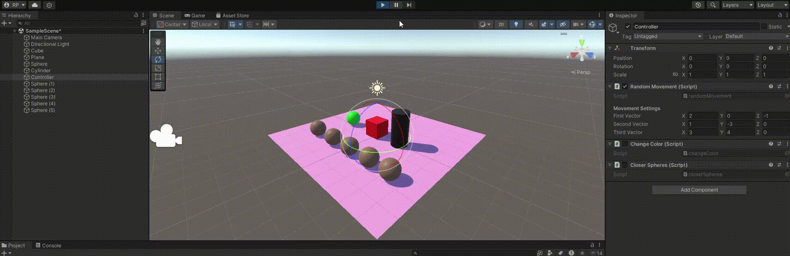
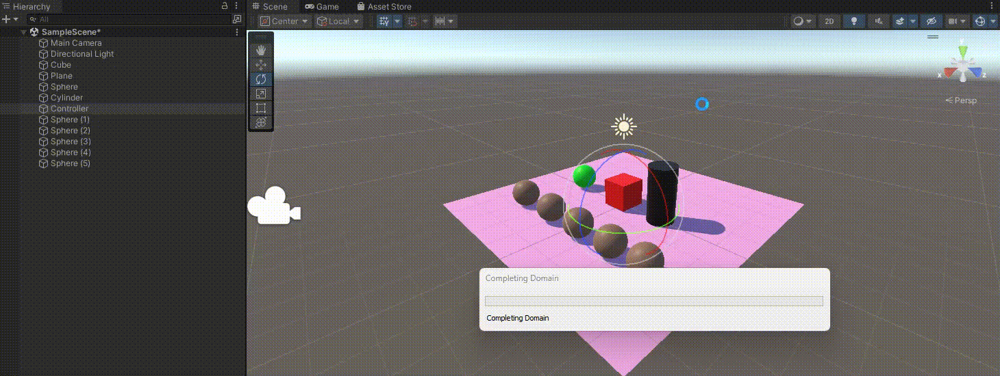
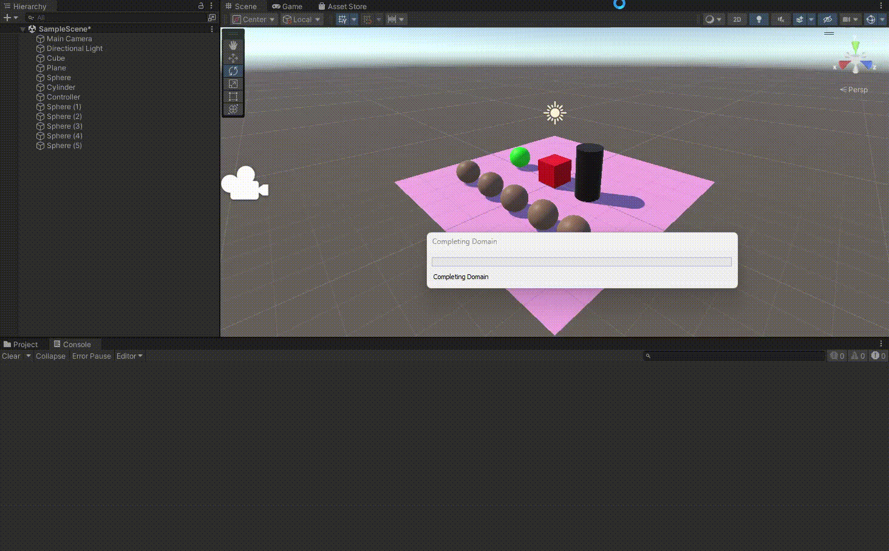

# Práctica 2 - Introducción a los scripts en Unity
En esta práctica hemos aprendido lo básico sobre los scripts en Unity. Hemos creado scripts con diferentes funcionalidades y que tocan diferentes aspectos de la programación en Unity.

## Ejercicio 1
En este primer script hemos creado un script que hace que un objeto se cambio aleatoriamente de color cada cierto número de frames, n, donde n es un número dado en el inspector, por defecto valdrá 120. Para conseguir esto se puede hacer poniendo público el número de frames pero esto no es lo más recomendable, ya que se puede hacer que el script sea más reutilizable si se hace que el número de frames sea privado y se utiliza la función `SerializeField` para que aparezca en el inspector. 

## Ejercicio 2
El segundo script fue considerablemente más facil ya que solo teníamos que hacer que un objeto imprimiera su nombre por consola. Además de recrear una escena con varios objetos y añadir el script a todos los objetos.

## Ejercicio 3
Este script hace operaciones entre vectores, en este caso, magnitudes de vectores, cálculo de ángulos entre vectores...

## Ejercicio 4
Al igual que en la primera práctica tuvimos que mostrar la posición de cierto objeto.

## Ejercicio 5
En este script hemos hecho que se calculen las distancias entre dos objetos y que se muestre por consola.

## Ejercicio 6
Este script ya es un poco más complicado, ya que hemos tenido que hacer que un objeto al que llamamos `Controller` mueva los otros tres objetos que se sitúan en el plano.

## Ejercicio 7
Para este script seguimos estudiando la clase Input y hemos hecho que este pendiente de las teclas que se pulsan y que haga que cambien de color al azar.

## Ejericio 8
En este último script hemos tenido que trabajar con arrays de objetos para calcular cuál es el objeto más cercano a un objeto dado, y el más lejano. El objeto más cercano se elevará y el más lejano se cambiará de color cuando se pulse la tecla `Space`.

