# Práctica 2 - Introducción a las físicas
En esta práctica se abordarán los conceptos básicos de las físicas en Unity, se realizarán ejercicios de movimiento y colisiones.

## Situaciones de aprendizaje
Con estas situaciones de aprendizaje se pretende comprender los conceptos básicos de las físicas en Unity, así como la implementación de las mismas en un proyecto de videojuego. No se diferencian mucho entre sí así que se las dividiré en dos categorías: No fisicas y fisicas.

### No físicas
Entendemos las "no físicas" como aquellas situaciones como aquellas que están todos los objetos sujetados por el plano, sin gravedad, y que a lo sumo se cae la esfera al comenzar el juego.

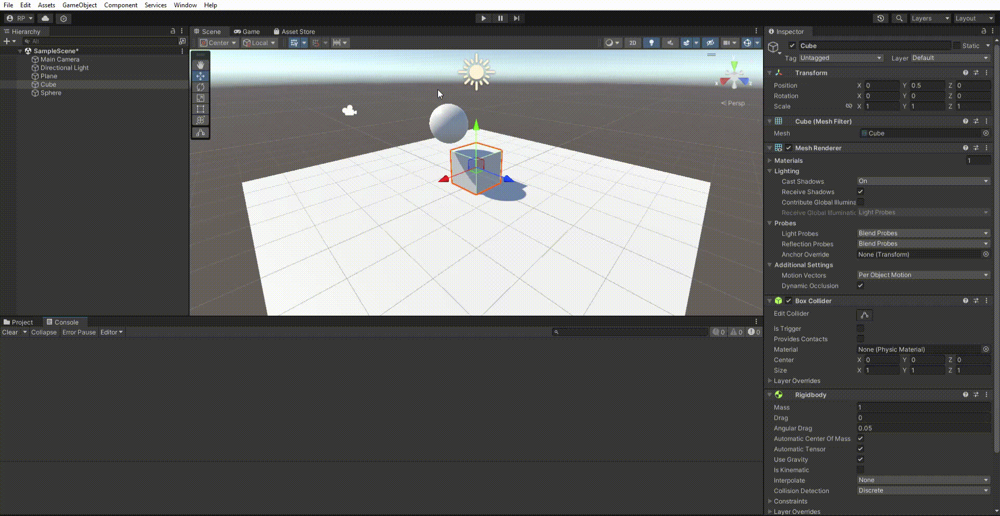

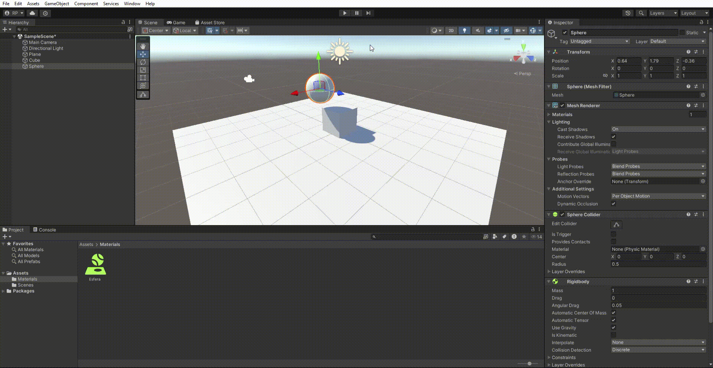

 
Esta situación trata de explicar el uso de isKinematic en un objeto, que hace que el objeto no sea afectado por la gravedad, pero si por las colisiones.

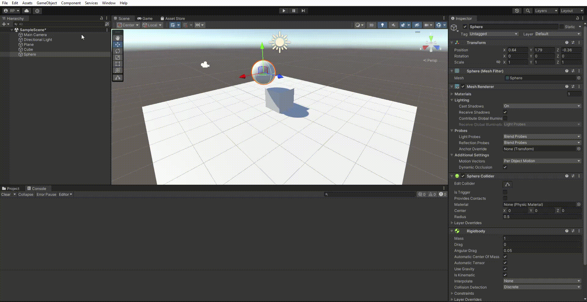

### Físicas
En las situaciones físicas, se implementa la gravedad y se diferencia de las situaciones anteriores en que los objetos simplemente caen al iniciar el juego.

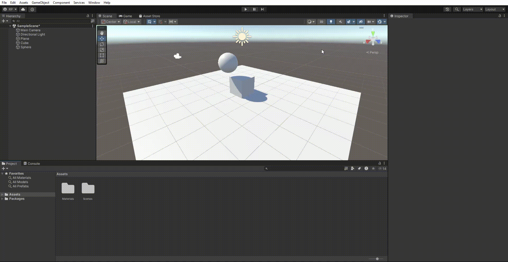

 
En estas situaciones se muestra la recreación de las físicas de un juego modificando la gravedad y la fricción de los objetos.

 

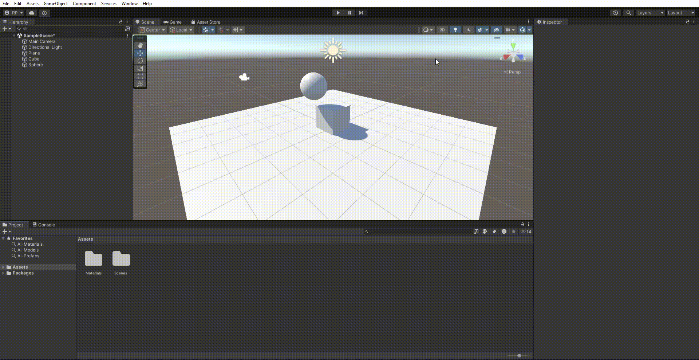

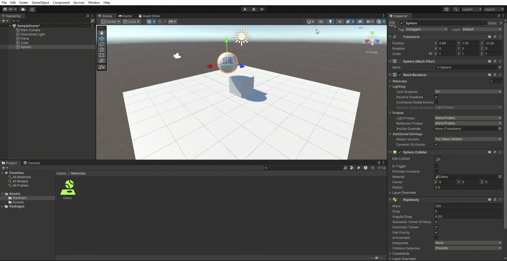

 
Con esto podemos ver la funcionalidad Triggers, que permite detectar colisiones sin que los objetos se vean afectados por la física.

 

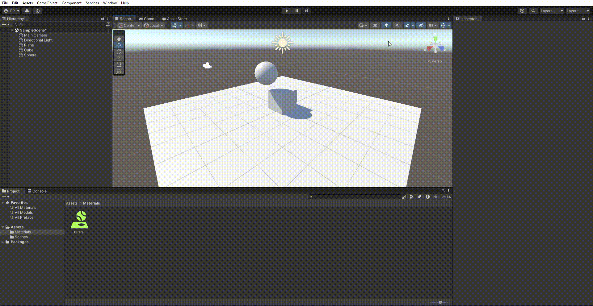
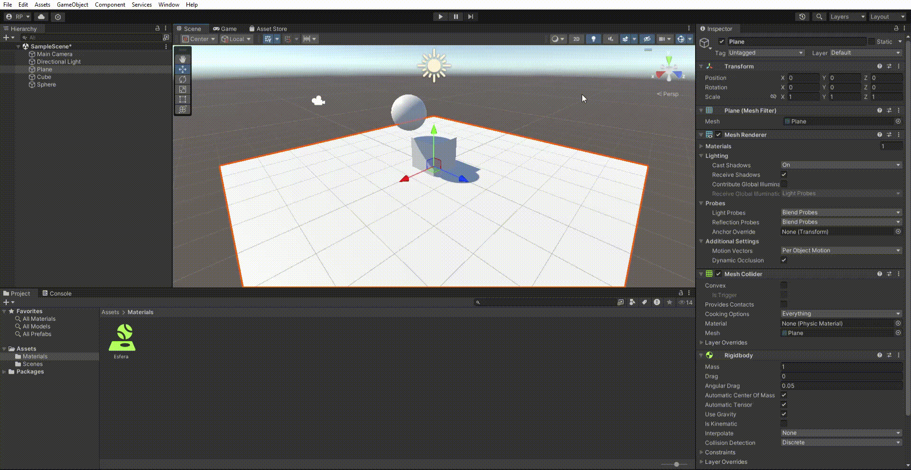

## Ejercicios

### Ejercicio 1
En este ejercicio se pide que se cree un cubo y que se muestre el producto de la velocidad dada y el valor del eje vertical y horizontal del teclado.

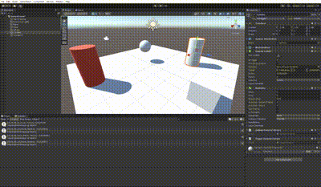

### Ejercicio 2
Simplemente cree una nueva entrada en el input manager para mapear el disparo del cañón a la tecla 'h'.

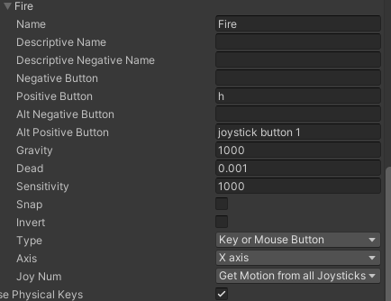

### Ejercicio 3
Con este script el objetivo es iniciarnos al movimiento de objetos en unity, creamos un vector moveDirection que se encargará de almacenar la dirección en la que se moverá el objeto, y luego se mueve en función de la velocidad y la dirección.

#### Situación a)
En esta situación se duplican las coordenadas del moveDirection para que el objeto se mueva más rápido.

#### Situación b)
En esta situación se duplica la velocidad del objeto para que se mueva más rápido al igual que en la situación a).

#### Situación c) y d)
Estas son situaciones en las que se toman valores no permitidos en el script, para gestionar esto lo que hacemos es tomar los valores mínimos y continuar con la ejecución normal.

#### Situación e)
Cambiando el parametro de Space en el Translate no noto cambio aparente en el movimiento del objeto.
| Self | World |
|------|-------|
| 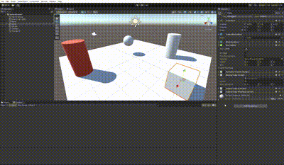 | |

### Ejercicio 4
Lo que se pide en este ejercicio es hacer que dos objetos se muevan con diferentes teclas, el cubo con las flechas y la esfera con las teclas `w`, `a`, `s`, `d`.

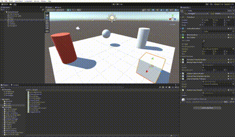

### Ejercicio 5 y 6

Estos ejercicios dependen del anterior y basicamente se basan en adaptar el anterior a diferentes cosas. El ejercicio 5 pide que el movimiento se haga proporcional al tiempo, esto se hace con `Time.DeltaTime`. El ejercicio 6 pide que el movimiento se haga con una velocidad constante.

### Ejercicio 7
El objetivo de este ejercicio es hacer que el objeto se mueva mirando siempre hacia la esfera.

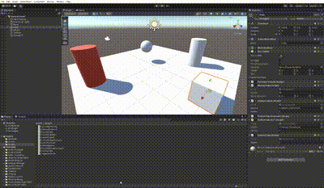

### Ejercicio 8
En este ejercicio simplemente tuvimos que modificar el script para que el objeto se mueva hacia delante en lugar de hacia la esfera, porque previamente se mira a ella.

### Ejercicio 9
Ahora añadimos un cilindro y fisicas a la escena. Empezamos observando el comportamiento de los objetos frente a colisiones.

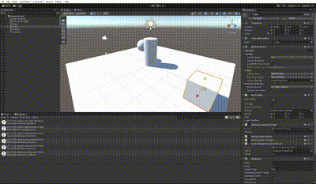

### Ejercicio 10
Para adaptar el ejercicio anterior a este tenemos que utilizar el rigidbody del objeto para moverlo y hacer que se mueva en función de la velocidad y la dirección.

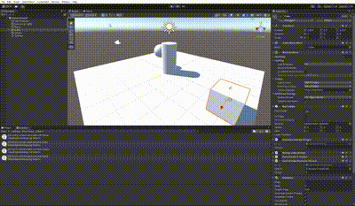

### Ejercicio 11
Al igual que en el ejercicio 9, tenemos que comprobar el comportamiento de los objetos pero esta vez frente a triggers.

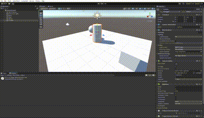

### Ejercicio 12
En este ejercicio se añade un nuevo objeto a la escena y se le da un script para que se mueva hacia la esfera, pero tambien tenemos la posibilidad de moverlo con las teclas `i`, `j`, `k`, `l`.

#### Situación mayor masa en la esfera
Podemos observar que cuanta más masa tiene la esfera más lento se mueve el objeto hacia ella y más le cuesta moverla.

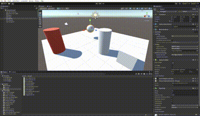

#### Situación menor masa en la esfera
En esta situación la esfera se mueve más rápido hacia el objeto y es más fácil moverla.

#### Situación isKinematic
Añadiendole el atributo `isKinematic` a la esfera, esta no se verá afectada por la física y no se moverá.

#### Situación trigger
En esta situación se añade un trigger a la esfera, lo que hace que el objeto se mueva hacia ella sin que se vea afectado por la física.

#### Situación con fricción
En esta situación se añade fricción a la esfera, lo que hace que el objeto se mueva más lento hacia ella.

