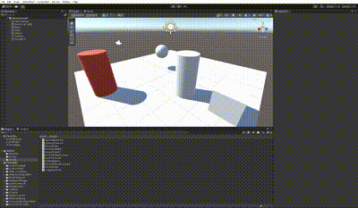
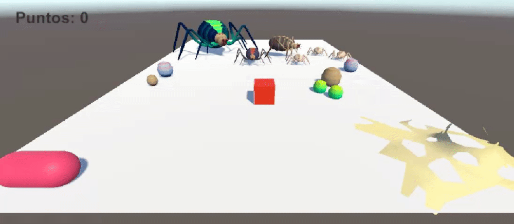
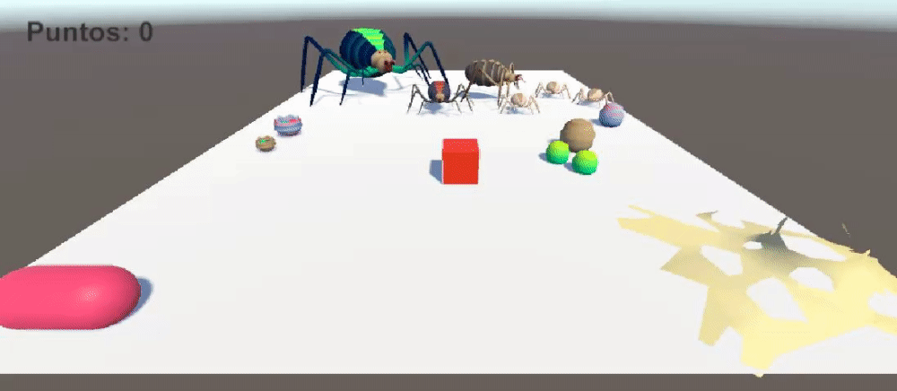
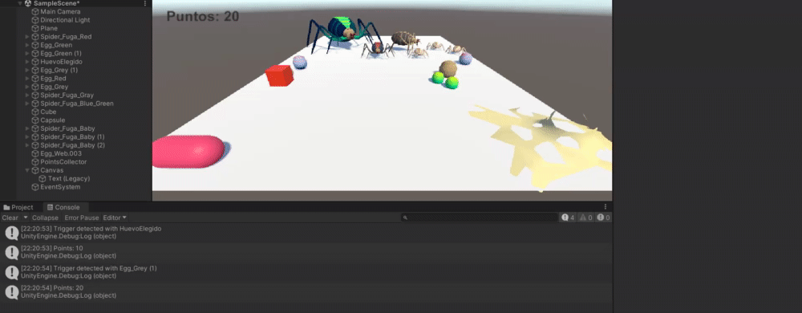
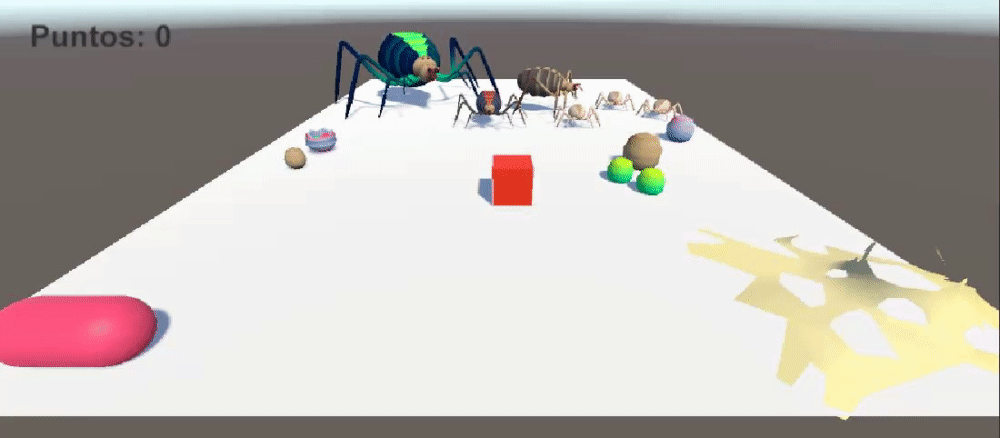
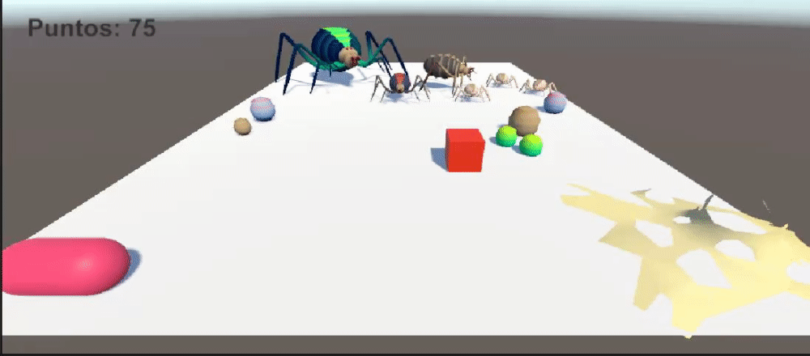
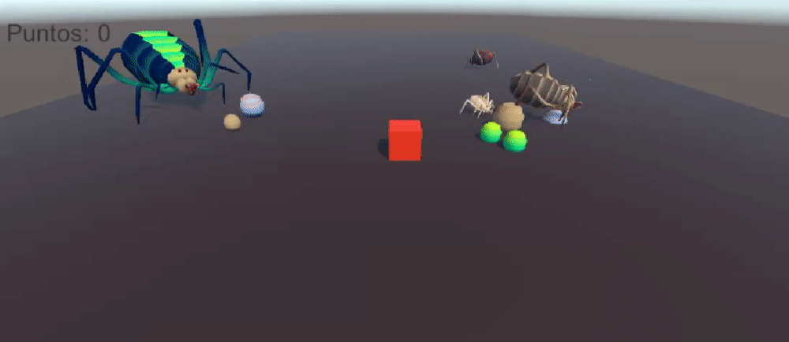

# Práctica 4 - Introducción a los eventos en Unity
En esta práctica se abordarán los conceptos básicos de los eventos en Unity, así como su implementación en un proyecto de videojuego. Para ello, se realizarán una serie de situaciones de aprendizaje y ejercicios que permitirán comprender el funcionamiento de los eventos en Unity.

## Ejercicios

### Ejercicio 1
En este ejercicio damos los primeros pasos con los eventos en Unity, creamos un script que se encargará de lanzar un evento cuando colisione con un objeto.

### Ejercicio 2
Simplemente generamos la escena que se usa apartir de este ejercicio.

### Ejercicio 3
Con este script hacemos que las arañas se muevan hacia la capsula cuando se toquen las arañas del grupo 1. Y que las demás arañas se muevan a un huevo del grupo 2 al azar.

### Ejercicio 4
En este ejercicio se debe hacer que las arañas se teletransporten a la posición de un huevo elegido y las otras arañas se orientan hacia la telaraña. 

### Ejercicio 5 

En este ejercicio se añade una mecánica de juego en la que cuando se toque un huevo del grupo uno se suman 5 puntos y cuando se toca un huevo del grupo dos se suman 10 puntos.

### Ejercicio 6 y 7
En estos ejercicios tienes que crear un canvas para que se muestre la puntuación y posteriormente añadir una recompensa cuando llegues a un cierto número de puntos.

| Ejercicio 6 | Ejercicio 7 |
| --- | --- |
|  |  |

### Ejercicio 8
Para este prototipo he aprovechado el script de los ejercicios anteriores y he añadido un script que hace que las arañas se muevan aleatoriamente por la escena, y que las persigues para obtener puntos.

### Ejercicio 9
Simplemente le añadimos físicas a las arañas para que se muevan de forma más realista.

